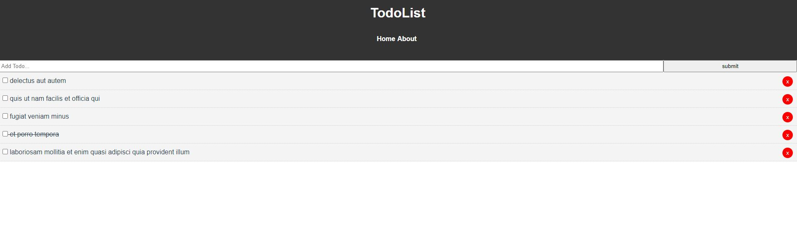

# vue_todolist
https://stephenstuder.com/Vue-todos/#/
This is a Vue todo list app that uses axios and json placeholder to showcase a todolist. 

## Project setup
```
npm install
```

### Compiles and hot-reloads for development
```
npm run serve
```

### Compiles and minifies for production
```
npm run build
```

### Lints and fixes files
```
npm run lint
```

### Customize configuration
See [Configuration Reference](https://cli.vuejs.org/config/).
